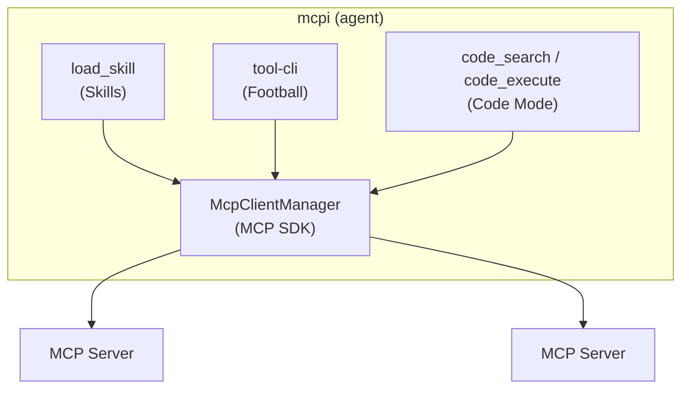

*This is the final Part of the Progressive Discovery in MCP series. See* [*Part 1*](/blog/progressive-discovery-in-mcp-part-1)*,* [*Part 2*](/blog/progressive-discovery-in-mcp-part-2)*,* [*Part 3*](/blog/progressive-discovery-in-mcp-part-3)*, and* [*Part 4*](/blog/progressive-discovery-in-mcp-part-4)*.*

I've spent four posts going deep on three approaches. This one is the synthesis. I want to make the case that having all three in one harness is cheaper than it looks, more useful than picking one, and worth doing now even though the spec is still in motion. Then I want to nudge the people who can actually move this forward: harness builders, MCP server authors, end users, and anyone with a stake in where the protocol goes next.

A confession to start with. The reason this series exists at all is that I gave [a talk at MCP Dev Summit](https://www.youtube.com/watch?v=ideYDMJKujE&list=PLjULwdJUtFdhIBhibLEogtK1XYCNaFyFl&index=10) titled "MCP vs CLI is the wrong question", spent the year before that waiting for harness builders to solve these issues, and eventually got annoyed enough to build [mcpi](https://github.com/SamMorrowDrums/mcpi-ext) myself so here we are.

## Three shapes of work, not three competing ideas

The reason for three approaches is that agents do three fundamentally different shapes of work with tools, and any single approach is bad at one or two of them.

**Procedural** - "do the canonical thing." There's a known workflow with known steps. PR review, issue triage, release prep. This is where [Skills](/blog/progressive-discovery-in-mcp-part-2) shine. The skill encodes the ceremony, avoids the footguns. The model doesn't have to reinvent the recipe and the harness gets to load only the tools the workflow actually needs.

**Investigative** - "I don't know what I'm looking for yet." Ad-hoc exploration, spot-checking, probing a server you've never used before. This is where [tool-cli](/blog/progressive-discovery-in-mcp-part-3) shines. Shell pipes, `jq` filters, `for` loops, `pandoc`. Zero ceremony, maximum flexibility, and the intermediate data never roundtrips through the model.

**Reductive** - "turn N items into 1 summary." Pagination, aggregation, joins, math. The intermediate data is large, the answer is small. This is where [Code Mode](/blog/progressive-discovery-in-mcp-part-4) shines. The model writes code, the sandbox runs it, only the final value crosses back into context.

Most tasks lean on one of these. Some need two. The interesting ones need all three. Imagine preparing release notes for a busy repository: you follow the project's release-prep workflow (skill), aggregate 150 PRs into a categorised summary (Code Mode and perhaps the output is still dumped into a file before handoff to model), then investigate the weird ones that don't fit your categories (tool-cli). One agent run, three modes of interaction, no friction at the seams.

They compose at the mechanical level too, not just the conceptual one. Code Mode is more useful when the sandbox has a writable filesystem and a couple of well-chosen CLIs on the path: large outputs land on disk instead of in the context window, and `jq` covers the long tail of shapes Code Mode shouldn't try to enumerate. A tool-cli running inside the same sandbox stops being a separate channel and just becomes another binary the generated code can shell out to. And once a skill has told the model that a capability exists, or once the model has discovered it for itself, it can reach for it in whatever context it's currently running in. The picture is less three doors and more an interlocking toolkit; the right door depends on what the model is trying to do at that moment.

These aren't competing implementations of the same idea. They're handling different shapes, maybe they even fit together.

## The headline thesis: it's cheap to ship all three

Here's the argument I want to land more than any other. **It's actually pretty cheap for a harness to offer all these approaches at once, and their different properties do actually make them more helpful for different tasks, so it's worth considering seriously if progressive discovery of MCP should be solved in more than one way in production agent harnesses.**

Roughly, what each approach costs a harness to add:

- **Skills** - one extra tool (`load_skill`), a `resources/list` call on connection to discover `skill://` resources, and a `defer_loading` hook (already first-class in [Anthropic's API](https://docs.claude.com/en/docs/agents-and-tools/tool-use/tool-search-tool) and [OpenAI's](https://platform.openai.com/docs/guides/tools-connectors-mcp), and hopefully other model providers catch up). The MCP server brings its own `skill://` payloads. There is no new spec dependency the client can't satisfy today (although the extension proposal may change).
- **tool-cli** - a JSON-RPC server bound to `127.0.0.1` with a per-session shared secret, and a tiny CLI binary. Four methods (`listServers`, `listTools`, `describeTool`, `callTool`). The protocol is in [the tool-cli repo](https://github.com/SamMorrowDrums/tool-cli) and the npm package is available for the client side.
- **Code Mode** - a sandbox you didn't write yourself ([isolated-vm](https://github.com/laverdet/isolated-vm), Workers isolates, [Anthropic's managed code execution](https://docs.claude.com/en/docs/agents-and-tools/tool-use/code-execution-tool), Pyodide, take your pick), an eligibility filter that whitelists `readOnlyHint: true` tools with `outputSchema`, and a callback bridge so `codemode.<tool>(...)` dispatches back through the same MCP client.

Each of those, in isolation, is a couple of weeks of work for a competent engineer. None of them require spec changes that aren't already in flight. And the leverage compounds: the audit log, the human-in-the-loop hooks, the rate limiting, and the annotation checks all live in the same place regardless of which approach the model uses.

I just think that many folks are looking for a silver bullet, but maybe the silver bullet is in the diversity of options the model can leverage. The best solution could be a function of the task, and an agent that has the right tools at hand is genuinely better at more tasks than one with any single strategy, where the cost of doing so is cheap enough.

## One choke point still does the heavy lifting

The reason these approaches compose cleanly is that all three route MCP calls back through the same harness:

One audit trail. One place to add human-in-the-loop. One place to check tool annotations. One place to rate-limit. The model switches between approaches mid-task and the observability story doesn't change. Drop a `console.log` of every tool call in the harness's MCP client and you've covered all three at once.

This is the part of the design that matters most for production. It's also the part most competing implementations have skipped, because they bolt one approach on top of MCP rather than rewiring the harness to own MCP. Server-side Code Mode without harness routing is closer to `eval()` than to a real agent runtime. A skill system that bypasses the harness can't gate destructive tools. A CLI that opens its own MCP connections doesn't get the agent's audit log. The choke point is what makes the other arguments work.

## Where the spec is, honestly

The spec is moving and it's worth being precise about what's settled and what isn't.

**Skills as primitive grouping.** The [Primitive Grouping Interest Group](https://github.com/modelcontextprotocol/access/pull/59) is real and active, with [Tapan Chugh](https://github.com/chughtapan) facilitating. The current draft I'm watching most closely is [`experimental-ext-grouping#13`](https://github.com/modelcontextprotocol/experimental-ext-grouping/pull/13), "Add Skills-as-Groups approach draft." It's open and being iterated on. I left review comments on it about keeping things stateless: I don't think referenced primitives should arrive via change-notifications. They should be available from the outset, and clients should choose to defer-load or expose them. That keeps the protocol simple and pushes the discovery cleverness into the client where it can vary by harness. There's also a parallel proposal, [SEP-2636: Progressive Tool Disclosure](https://github.com/modelcontextprotocol/modelcontextprotocol/pull/2636), which is worth tracking. The two aren't necessarily competing: skills-as-groups is a server-side metadata mechanism; progressive disclosure is a client-side strategy. The protocol benefits from both.

**Dynamic tool search.** [SEP-1821](https://github.com/modelcontextprotocol/modelcontextprotocol/issues/1821) and its proposed implementation [PR #1822](https://github.com/modelcontextprotocol/modelcontextprotocol/pull/1822) cover server-driven dynamic tool discovery. Anthropic's [tool search tool](https://www.anthropic.com/engineering/advanced-tool-use) is already shipping the model-side version of this idea; the spec work is about making it interoperable. Expect this to land in some form.

**Structured outputs.** Already in spec since [the 2025-06-18 release](https://modelcontextprotocol.io/specification/2025-11-25/server/tools#structured-content). Underused. This is the foundation Code Mode and the more interesting tool-cli `jq` workflows are built on. If you maintain a server with read-only tools and you haven't shipped `outputSchema` on them, you are leaving real progressive-discovery wins on the floor.

**MCP Apps / generative UI.** The [`ext-apps`](https://github.com/modelcontextprotocol/ext-apps) extension (SEP-1865, evolved from the [MCP-UI](https://mcpui.dev/) community work) gives the protocol a way to render typed structured outputs as interactive UI. Combined with Code Mode this is where the most exciting demos are going to come from over the next year. It's not in the core spec, but it's a real working extension.

**On the implementation side**, [PR #2382 on github-mcp-server](https://github.com/github/github-mcp-server/pull/2382) is still a draft. It adds `OutputSchema` and `StructuredContent` to read-only tools like `list_issues`, `search_code`, `list_pull_requests`, and `get_me`, plus twenty-seven skills replacing the old server instructions. I want it merged. It's the proof-of-life for skills-as-groups on a real high-traffic server, and it's the dependency that makes Code Mode actually useful against GitHub.

## Three is not redundancy, in numbers

The design argument above is the easy part. The honest test is whether any of it survives contact with real models doing real work, so I built an eval rig to find out, which is most of why this post took as long as it did.

The setup: 36 hand-authored GitHub jobs-to-be-done, run as live multi-turn agent sessions against the real [github-mcp-server](https://github.com/github/github-mcp-server), crossing eight tool-disclosure and execution strategies by six current frontier models by three seeds. Every upstream dependency is pinned, every session is graded pass or fail by a single LLM judge against fixed per-task rubrics, so I treat close success differences cautiously. The harness is reproducible. Just over five thousand graded sessions in total.

I expected the combined surface to separate cleanly on overall success. It didn't, and a real caveat goes with that: this eval ran against a single MCP server, which is the friendliest possible regime for just loading everything up front. The case for progressive disclosure is strongest exactly where this didn't test, with many servers and hundreds of tools competing for context, so what follows is a limited verdict from a soft setup. Across the whole 36-task set, success rates sit between about 84 and 90 percent for every mechanism, with overlapping confidence intervals. The combined surface comes out numerically highest at around 90, but it does not statistically separate from any of the others on success alone. That looks like a flat result until you split the tasks: 30 of the 36 land between 0.96 and 0.99 success for every mechanism, a dead heat. All of the actual separation lives in the six bulk-aggregation tasks, where the model has to count, bucket, or aggregate over roughly one to two hundred live items. The tasks were deliberately authored to span an easy-to-hard range, not sampled from production, so the right read isn't "most real traffic is easy", it's "on the easy-to-moderate band of a deliberately graded set, your choice of progressive discovery strategy is essentially noise; only the genuinely hard work pulls the strategies apart." The interesting question becomes what separates them on the hard tail, and at what cost.

On the hard tail two clean clusters appear, and the cluster boundary is more interesting than any individual mechanism's standing.

Everything that gives the model somewhere to run code or shell (tool-CLI, code mode, all three surfaces together, and even the gh-CLI baseline as out-of-family reference) sits in the lower-cost execution-capable cluster on the left, generally at equal-or-better success. Everything that still drives the tools by hand, one call at a time, whether the catalog was loaded up front (Static MCP) or revealed on demand (Tool Search, Skills over MCP on its own), sits in the dearer cluster on the right without a success advantage. That is the key point, and it is consistent with the rest of this series: deferring schema loading is good housekeeping, but on the hard tail the thing that actually pays is not how the tools were disclosed, it is whether the model had somewhere to run code or shell over the results instead of walking a hundred items by hand. The execution cluster is roughly two and a half to four times cheaper than the static-loading cluster at equal or better success. The combined surface sits at the top of that cheap cluster, the highest success of the lot while still costing a fraction of anything on the static side, which is suggestive, but it does not statistically separate from its execution siblings when pooled. I'll take a family-boundary result that holds across six models over a hero result that doesn't.

One configuration is worth pulling out as an existence proof, with the caveat that it is one configuration. The strongest individual run is the combined surface on GPT-5.4. On the hard aggregation tail it reaches about 72 percent success at about 25 cents per task, versus Static MCP at about 50 percent for 12 cents and the gh-CLI baseline at about 22 percent for 34 cents. Across the full 36-task set the combined surface lands around 95 percent at about 9 cents, Static MCP around 92 percent at about 5 cents, and the gh-CLI baseline around 83 percent at about 8 cents. On the genuinely hard work the combined surface is both more accurate and cheaper than the model just shelling out to gh. That is not the same as saying the combined surface always wins; it numerically beats the gh-CLI baseline on the tail but does not clear conventional significance when pooled. Read it as "this is what it can look like when it lands well."

The most interesting thing in the data, though, is what the model does with the combined surface when you give it the choice.

Across all 36 tasks, tool-CLI is the most common primary route, used as the dominant channel in about 54 percent of runs. Skills are present in about 46 percent of runs, code mode in about 28, and only about 3 percent of runs end up stacking all three at once (the tool-CLI figure is its share as the dominant route, while the skills and code-mode figures are how often each surface shows up at all, so the three are measured differently and are not meant to sum). On the hard aggregation tail that picture rearranges itself: code mode presence jumps to about 73 percent (the model reaches for code when the job is count and aggregate), tool-CLI as the primary route drops to about 6 percent (it steps aside, it hasn't gone anywhere), and skills sit steady at about 45. "Chosen" here is the observed route taken by the agent, not a claim that the model deliberated among three labelled options. The three surfaces are not all firing at once. The harness picks the surface that fits the shape of the work in front of it, and the shape of the work is what changes between the saturated easy-to-moderate tasks and the hard aggregation tail. That is what the title of this post means. Three is not redundancy because the model is not using three at once; it's choosing one of three because the shape of the next ten minutes of work is not the same as the last ten.

A few caveats that strengthen rather than weaken this read. With more MCP servers connected, the static cluster's cost would scale with the catalog and the gap would widen, not narrow, so the family-boundary result is probably an underestimate of what's actually on the table. The choke-point argument from earlier in the series is independent of any of this and still holds. And the gh-CLI baseline is a hard one to beat: gh is famously well-documented and over-represented in model training data, so a less well-known CLI would have given the combined surface an easier ride, not a harder one. The accuracy gain on the tail also matters here. If the win were just fewer tokens at the same answer, you could call it cosmetic; on the hard tasks the answers themselves are better, which is what tells me this isn't a token-count optimisation dressed up as a methodology breakthrough.

None of this proves that progressive discovery in MCP has a single right answer, and I don't think it does. What it shows, on this task set, on these models, at this list-price snapshot, is that the marginal measured cost of offering multiple surfaces in this harness was small, the harness will use the surfaces selectively when it has them, and on the work that actually separates strategies, having somewhere to run code or shell sharply improves cost at equal-or-better success. That is enough for me to keep pushing on the design.

## Where the rest of the field is

The corollary to "I haven't measured everything" is "I haven't explored everything either." This space is moving fast and most of the most useful work is happening in parallel, sometimes by people who don't know they're working on the same problem. A few threads worth knowing about, with what I think each one moved forward and where I'd push them further.

**Grouping has been tried in core three times.** Tool grouping isn't a new idea in MCP. Paul Carleton's [RFC #322 "Search"](https://github.com/modelcontextprotocol/modelcontextprotocol/pull/322) tried it in April 2025. Tapan Chugh's [SEP-1292 "Namespaces using URIs"](https://github.com/modelcontextprotocol/modelcontextprotocol/issues/1292) tried it in August 2025. Cliff Hall's [SEP-1300 "Tool Filtering with Groups and Tags"](https://github.com/modelcontextprotocol/modelcontextprotocol/issues/1300) tried it the same month. All three closed in core. The work consolidated in [`experimental-ext-grouping`](https://github.com/modelcontextprotocol/experimental-ext-grouping), where the [Primitive Grouping IG](https://github.com/modelcontextprotocol/modelcontextprotocol/issues/1734) has the thread, with skills-as-groups the live draft. What the rejection history actually tells you isn't that grouping is wrong; it's that an abstraction has to land where it pays for itself. Skills-as-groups is the most concrete attempt so far because the grouping is something the model is motivated to use, not metadata that exists for its own sake. The open question is which parts earn their way from extension into core, and the right way to influence that is to comment on the draft.

**The research has converged on calling this a context engineering problem, not a retrieval one.** [LiveMCPBench](https://arxiv.org/abs/2508.01780) (ICIP-CAS, 2025) is the empirical anchor: at 70 MCP servers and 527 tools, retrieval errors are nearly half of all agent failures. It made the size of the problem measurable in production conditions. What it didn't separate is whether the failures came from missing tools, mis-ranked tools, or correctly-ranked tools the model still couldn't compose. [A2X](https://arxiv.org/abs/2605.29270) (Virginia Tech, May 2026) names "LLM-native progressive disclosure" verbatim and ships an LLM-driven hierarchical taxonomy walked layer-by-layer at roughly a ninth of the prompt-token cost of dumping the full catalog. The taxonomy is constructed offline though, so the open question is how to keep it fresh as servers change. [Agent-as-a-Graph](https://arxiv.org/abs/2511.18194) (Lumer et al., Nov 2025) takes a different angle, building a knowledge graph over agents and their tools and traversing it at query time, evaluated on LiveMCPBench; the gain is real (Recall@5 up roughly 15 points) but it inherits the maintenance burden of any explicit graph. [BioManus](https://arxiv.org/abs/2606.04494) (June 2026) demonstrates the same idea for domain-specific MCP agents with typed heterogeneous graphs and sub-linear context footprint, which is the strongest empirical evidence so far that inter-tool relationship modelling pays off. [NESTFUL](https://aclanthology.org/2025.emnlp-main.1702/) (IBM Research, EMNLP 2025) is the honest counterweight: nested API sequencing is hard, even for frontier models, GPT-4o capping at 28% full-sequence accuracy. Hierarchy isn't free. And the design-pattern names are slowly settling: ["metadata-driven progressive disclosure"](https://arxiv.org/abs/2602.20867) in the SoK survey on agentic skills, ["Inter-Tool Relationship Declaration"](https://arxiv.org/abs/2602.18764) in Andreas Schlapbach's MCP × schema-guided dialogue paper. None of these are settled answers. They are directionally correct in a space that doesn't have a definitive one yet.

It's worth being honest that a lot of the rest of the public MCP discourse isn't this. The "MCP vs CLI" content marketing genre largely recycles the same talking points (schemas bloat context, CLIs are familiar to models, MCP is good for governance) without distinguishing harness design from protocol design. Several "benchmark" posts I traced through turned out to be simulator runs or single-task comparisons dressed up as broad claims. The signal-to-noise here is real but the signal is small. The papers above are the ones I'd actually read, and the conversations in the IG meetings are where the next round of progress is being argued out, not on Substack.

**Practitioners are converging on the same primitives independently.** [FastMCP's `SkillsProvider`](https://github.com/PrefectHQ/fastmcp) (jlowin) shipped skills served via MCP Resources before any formal spec, with lazy loading and metadata-first discovery; it's cited as the canonical existing implementation by [SEP-2640 (Agent Skills)](https://github.com/modelcontextprotocol/modelcontextprotocol/pull/2640). [pydantic-ai v1.105.0](https://github.com/pydantic/pydantic-ai) (June 2026) introduced `Capability(defer_loading=True, ...)` with a `load_capability` tool, reaching the same prompt-cache-preserving conclusion as mcpi's [Decision 008](https://github.com/SamMorrowDrums/mcpi-ext/blob/main/DECISIONS.md) by a different route. [OpenAI's Responses API](https://platform.openai.com/docs/guides/tools-connectors-mcp) shipped its own `defer_loading` for `gpt-5.4` and above, validating that the prompt-cache argument cuts across providers. Kun Chen's [AXI principles](https://github.com/kunchenguid/axi) (ex-Atlassian Rovo-Dev lead) name ten orthogonal things production CLIs should do better for agents: token-efficient output formats, minimal default schemas, pre-computed aggregates, contextual disclosure. That's the intra-tool design discipline the protocol-level discussions tend to skip past. None of these projects coordinated with each other or with mcpi. They converged because the constraints are real.

The [github-mcp-server I help maintain](https://github.com/github/github-mcp-server) is shipping the same moves, in flight or merged: [CSV output for default list tools](https://github.com/github/github-mcp-server/pull/2450) (alongside JSON, to cut token cost on large pages), [structured outputs for read-only tools behind a flag](https://github.com/github/github-mcp-server/pull/2468), [granular issue tools behind `remote_mcp_issue_fields`](https://github.com/github/github-mcp-server/pull/2520) for agents that want finer-grained surfaces, [response-size reductions](https://github.com/github/github-mcp-server/pull/2563), and [`skill://` resource templates for Agent Skills discovery](https://github.com/github/github-mcp-server/pull/2129) in review. Some merged, some open, some gated behind insiders flags because different agents want different things. The actual lesson from running a real production server is that you can't pick a winner. The protocol's job is to make all of these strategies concurrently available so the harness, the model, and the server can negotiate what works for the task.

**There's a related conversation about subagents that's the same problem in a different shape.** Subagents - [Claude Code's `dispatch_agent`](https://simonwillison.net/2025/Jun/2/claude-trace/) as reverse-engineered by Simon Willison via claude-trace, OpenAI Agents SDK's "agents as tools", Phil Schmid's [recent pattern guide](https://www.philschmid.de/use-mcp-servers) - are often cited as the parallel solution to context bloat. They're real and they're effective for clear, isolated tasks. But they don't save tokens. They shift them across separate context windows. The unsolved problem they share with MCP discovery is the same one in a different shape: what should the parent send the subagent, and what should come back, so you get the conclusion and the necessary data without bloat? Tool discovery is one fragment of a wider context-engineering problem the whole agent space keeps re-solving in different shapes. MCP isn't uniquely challenged. It's being explicit about a hard problem that everyone else is solving implicitly.

I haven't exhaustively explored any of these directions, and I'd be suspicious of anyone who claims they have. Whatever the right combined answer turns out to be - graph-based traversal over typed hierarchies, skills-as-groups in the spec, defer-loading by default, server-side compression, subagent orchestration, intra-tool ergonomics, something we haven't named yet - it will feel obvious in hindsight. The way it arrives is the way it's already arriving: harness builders, server authors, spec contributors, and researchers iterating in public on the same problem, with the noise filtered out by people actually shipping the thing and seeing what holds up.

## What if we do none of this?

A fair question. What's the cost of the status quo, where harnesses don't ship skills over MCP, don't ship an mcp cli, don't ship Code Mode, and just keep loading every tool schema into every session?

The fallback that's actually cheap and shipping today is Anthropic's [Tool Search Tool](https://docs.claude.com/en/docs/agents-and-tools/tool-use/tool-search-tool). It's a single tool the model can call to search across deferred tools by keyword, with the matching tool definitions returned for use on the next turn. Properties:

- **The good.** Cheap to implement, no spec changes needed, plays nicely with prompt cache because the deferred tools never enter the system prompt until they're searched for. Real, measurable context savings on servers with many tools. If you do nothing else from this series, ship Tool Search.
- **The bad.** Discovery is purely model-driven. The model has to think "there might be a tool for this" and write a search query. It frequently doesn't, and instead either tries to do the task with whatever's already loaded, falls back on workarounds (writing bash, using direct APIs it half-remembers from training), or just hallucinates a function call. Skills push the right tools at the model when a workflow fires; Tool Search asks the model to pull. Pulling is harder.

So Tool Search Tool is a real option, and a good one. It's just not the ceiling.

The much worse outcome is that we don't even get that, and the pressure stays on server developers to keep their tool surface as small as possible. That's the path I want to argue against most strongly. A 1,000-tool MCP server with rich annotations and granular operations is a *better* server than a 20-tool consolidated one, *if* the client can do progressive discovery. Without progressive discovery, the 1,000-tool server is unusable and the consolidated one wins by default. That's a missed opportunity pretenting it is a best practice. Server developers deserve a client ecosystem that lets them ship the surface area their domain actually needs.

## A nudge, in three directions

This is the part of the post I really wanted to write.

### If you build agent harnesses

[Mario was right](https://mariozechner.at/posts/2025-11-02-what-if-you-dont-need-mcp/) that two MCP servers exposing 47 tools through 32k tokens of schema is a bad agent experience. He was right that pipelining and keeping transforms out of context is the issue that really matters. Where I disagree is the conclusion. The implementations that prompted his post weren't MCP failing. They were MCP being shipped without context engineering. With the harness doing real work, the same protocol gives you a far better agent than four bash scripts and a 225-token README, while preserving observability, annotations, and a real security story.

Don't give up on MCP. The pieces are in the protocol, and the implementations are not difficult. If you ship one of the three approaches from this series this quarter, you will measurably improve your harness. If you ship all three, you will leapfrog every harness that picked one.

### If you build MCP servers

Three things worth doing, roughly in order of impact:

1. **Ship `outputSchema` on every read tool you can.** It costs you a JSON-Schema definition per tool. It unlocks Code Mode, makes tool-cli's pipe story work, and gives clients deterministic shapes to render UI from. There is almost no reason not to.
2. **Write `skill://` resources for the workflows your users actually run.** Not for every tool, just for the workflows that have a canonical recipe. Each skill replaces a chunk of server instructions and a chunk of tool descriptions, both of which were paid up-front in every session whether they were needed or not.
3. **Stop treating server instructions as the place workflow guidance lives.** They're a monolith, they load at connection, and they don't know what the user is doing. Skills cost a tiny amount of context to advertise and unlock the full workflow body only when needed. The economics aren't close.

### If you use agents

You can demand more of your MCP implementations. If your harness is loading hundreds of tool schemas you'll never use into every session, that's a choice the harness made for you. Ask for progressive discovery. Ask for skills. Ask for code mode for read-only aggregations. The signal that users want this is part of what moves harness vendors.

### If you want to influence the protocol

I'm a maintainer of MCP and an active member of a few of its working and interest groups, so I can speak to this directly. The way contributions, comments, and feedback get received is not gatekept. The most useful thing you can bring to a spec discussion is not strong opinions: it's data, an implementation intention ("here's what I'd build if this were spec'd this way"), and concrete use-cases. Open issues. Comment on SEPs. Comment on draft PRs like [`experimental-ext-grouping#13`](https://github.com/modelcontextprotocol/experimental-ext-grouping/pull/13). Show up to the working-group meetings. Ship a prototype and link to it. The people steering the protocol are explicitly looking for this kind of input, not just from large vendors. If you've been waiting for an invitation, this is it.

## Mistakes I made as an MCP server developer

Some honesty before the closer. I've worked on the [GitHub MCP Server](https://github.com/github/github-mcp-server) for over a year. I got real things wrong, and most of them are relevant to anyone in a similar position.

**I expected clients to fix the implementation problems.** I assumed harness builders were as motivated as I was to do real context engineering on top of MCP, and would course-correct as the tool count problem became obvious. They weren't, and they didn't. They mostly preferred to work around the protocol (mostly by leaning on bash) rather than push back into the harness. That's a perfectly reasonable engineering decision in the short term, and it left every MCP server in the same spot regardless of how thoughtfully it was built. The lesson: if you build a server, don't wait. Ship the experiments yourself, even as an extension or a fork. The signal from working code is louder than the signal from issue comments.

**I thought I didn't need to share the challenges, experiences, and solutions from the server side.** They weren't as obvious to anyone outside the project as I assumed. Things that felt routine to us (why we have so many tools, why we consolidated some and not others, why we picked the annotations we did, why server instructions sit where they do) turned out to be useful context for harness builders trying to design around us. This series is partly an attempt to fix that, retroactively. If you maintain a server with non-trivial usage, write down what you've learned. The ecosystem benefits more than you'd expect.

**The MCP spec itself made some calls that haven't aged as well as we'd hoped.** Server instructions are the obvious one; skills feel like such a clear replacement to me at this point that I'd rather have skills as the only mechanism. [Dynamic Client Registration](https://modelcontextprotocol.io/specification/2025-11-25/basic/authorization#dynamic-client-registration) has rough edges in practice. There are still bits being ironed out. None of that is fatal. The protocol has the capacity to evolve (it's already deprecated [Roots, Sampling, and Logging](https://github.com/modelcontextprotocol/modelcontextprotocol/pull/2577) when they didn't earn their keep), and that capacity is itself one of MCP's most underrated properties.

Many seem to think the differences between MCP compared to CLIs, APIs, and skills are trivialities. They are objectively wrong, and I say that with some confidence. I've watched fairly staunch MCP critics realise they absolutely have to have first-class support for [MCP Apps](https://github.com/modelcontextprotocol/ext-apps) because generative UI is a huge unlock for productivity work, and there is no clean way to land that on top of a CLI or a raw API. Don't underestimate the power of a specification built for agents that distinguishes between agents and end users, between operators and consumers, between tools and resources, between prompts and skills. And critically, don't mistake a protocol for the implementations you've seen of it. The early implementations are how MCP got dismissed; the next generation of implementations is how it gets taken seriously.

## The future of MCP is genuinely exciting

The takes that say MCP is a flash in the pan, that skills will replace it, that CLIs make it redundant, miss what the protocol is actually for. MCP is not "a tool list format." It's a contract between three parties (server, client, model) with the capacity to evolve as agent needs evolve, and it's one of the few places in the agent stack where that contract is explicit, versioned, and negotiable.

That capacity is the thing. We've already seen it absorb structured outputs, resources, prompts, sampling, and now primitive grouping. We're about to see it absorb generative UI through MCP Apps. The discovery problem (how do we expose the right tools to the right model at the right time?) is hard, and it isn't going to have one universal answer. The protocol that's flexible enough to host skills, CLIs, and Code Mode against the same servers, and to distinguish between agent users, end users, and operators, is the protocol that gets to keep evolving. The protocols that pick one answer get to be obsolete.

What I want to happen now is for everyone to keep iterating. Keep experimenting. Build weird and wonderful clients. Push the spec. Build agents that can truly discover the tools they actually need from many thousands without choking on context, without hallucinating substitutes, without falling back on workarounds. We should not settle for less than that, and we don't have to.

The agents that work best over the next few years will be the ones whose harnesses are smart about what they reveal and when. MCP is the layer where that smartness is portable. That's worth showing up for.

## Try it yourself, and what to read next

The [mcpi-ext source](https://github.com/SamMorrowDrums/mcpi-ext) is public, the [tool-cli package](https://github.com/SamMorrowDrums/tool-cli) is on npm, and the [GitHub MCP Server skill-discovery branch](https://github.com/github/github-mcp-server/pull/2382) ships a working set of skills you can experiment with today. If you went through any of the earlier parts' setup sections you already have everything installed.

A short reading list, in roughly the order I'd suggest:

- [Anthropic on advanced tool use](https://www.anthropic.com/engineering/advanced-tool-use) and [code execution with MCP](https://www.anthropic.com/engineering/code-execution-with-mcp) - the model-side and execution-side state of the art.
- [Cloudflare's Code Mode](https://blog.cloudflare.com/code-mode/) and [Matt Carey's Code Mode + MCP](https://blog.cloudflare.com/code-mode-mcp/) follow-up - the production case for code over tools.
- [`experimental-ext-grouping#13`](https://github.com/modelcontextprotocol/experimental-ext-grouping/pull/13) and [SEP-2636](https://github.com/modelcontextprotocol/modelcontextprotocol/pull/2636) - where the spec conversation is happening right now.
- [Ruben Casas on generative UI for MCP Apps](https://www.youtube.com/watch?v=hCMrEfPG2Yg) - the next thing structured outputs unlock.
- [My MCP Dev Summit talk](https://www.youtube.com/watch?v=ideYDMJKujE&list=PLjULwdJUtFdhIBhibLEogtK1XYCNaFyFl&index=10) - for my hot take on MCP vs CLI.

If you build something on top of any of this, disagree with any of it, or just want to compare notes, the [discussion thread for this series](https://github.com/SamMorrowDrums/cv/discussions/63) is open. I'd genuinely love to hear what you're building.

---

*Have thoughts on this article or progressive discovery in MCP in general? I opened a* [*discussion on GitHub*](https://github.com/SamMorrowDrums/cv/discussions/63) *for this series.*
