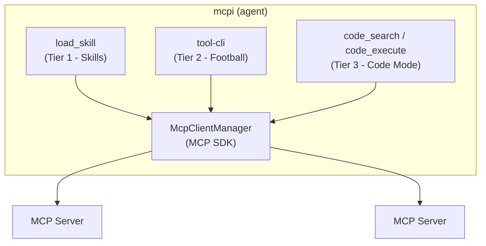

> *They asked the three: "Why are there three of you? Isn't one enough?"*

*This is Part 5 of the Progressive Discovery in MCP series. See* [*Part 1*](/blog/progressive-discovery-in-mcp-part-1)*,* [*Part 2*](/blog/progressive-discovery-in-mcp-part-2)*,* [*Part 3*](/blog/progressive-discovery-in-mcp-part-3)*, and* [*Part 4*](/blog/progressive-discovery-in-mcp-part-4)*.*

I've spent four posts going deep on each tier. Now I want to step back and be honest about what this actually is, where I think it matters, and what's left to do.

## Why three and not one

The three tiers exist because there are three fundamentally different shapes of work an agent does with tools:

**Procedural** - "do the canonical thing." There's a known workflow with known steps. PR review, issue triage, release prep. This is where skills shine. The skill encodes the ceremony. The model doesn't have to reinvent the recipe.

**Investigative** - "I don't know what I'm looking for yet." Ad-hoc exploration, spot-checking, poking around a server you haven't used before. This is where tool-cli shines. Shell pipes, jq filters, for loops. Zero ceremony, maximum flexibility.

**Reductive** - "turn N items into 1 summary." Pagination, aggregation, joins, math. The intermediate data is large but the answer is small. This is where Code Mode shines. The model writes code, V8 runs it, only the result enters context.

Most tasks are one of these. Some are two. The interesting ones are all three - like preparing release notes, where you follow the release workflow (skill), aggregate 150 PRs into a summary (Code Mode), then investigate the weird ones that don't fit the pattern (tool-cli). The tiers aren't competing. They're handling different shapes.

## The architecture that makes composition work

The reason these compose cleanly is that all three route through the same harness:

One audit trail. One place to add human-in-the-loop. One place to check tool annotations. One place to rate-limit. The model switches between tiers mid-task and the observability doesn't change. This is the part of my design that matters most for real production use. It's also the part most competing implementations have neglected, because they don't try to change the harness and build around it. Harness developers - do better!

## What this is and what it isn't

This is a proof of concept. I built it to move the conversation forward, not to ship a production system. [mcpi-ext](https://github.com/SamMorrowDrums/mcpi-ext) is experimental. The [skills-as-groups spec proposal](https://github.com/modelcontextprotocol/experimental-ext-grouping/pull/13) is a draft. The structured output work on the [GitHub MCP Server](https://github.com/github/github-mcp-server/pull/2382) is a PR, not a release.

But the design works. I've used it. The three tiers genuinely handle different situations better than any single approach, and the harness routing genuinely provides observability and security across all of them.

## What's left to do

There's a lot. I don't want to pretend this is finished.

**Skills need server adoption.** The mechanism only works if MCP servers ship `skill://` resources. That requires server developers to think about their tools in terms of user workflows, write good skill bodies, and test coverage. I've started doing this on the GitHub MCP Server ([PR #2382](https://github.com/github/github-mcp-server/pull/2382) adds twenty-seven skills replacing the old server instructions), but one server isn't an ecosystem. If you build MCP servers, the [server developer guide](https://github.com/SamMorrowDrums/mcpi-ext/blob/main/docs/server-developer-guide.md) covers the format and best practices. Your input on the [spec proposal](https://github.com/modelcontextprotocol/experimental-ext-grouping/pull/13) matters.

**Structured output enables the other two tiers.** tool-cli returns JSON that flows through pipes - but without `outputSchema`, clients don't know the shape ahead of time. Code Mode requires typed responses to let models write `.filter()` and `.map()` confidently. That same PR on the GitHub MCP Server adds `OutputSchema` and `StructuredContent` to read-only tools like `list_issues`, `search_code`, and `get_me`. Multi-method tools like `issue_read` (which returns different shapes per method) stay untyped for now - a single output schema can't represent a union. But for the tools where it works, structured output is what makes progressive discovery practical rather than theoretical. It's an underused MCP feature that becomes essential here.

**Human-in-the-loop needs real work.** The harness provides the choke point. The annotations exist. But the actual UX of confirmation prompts needs to be good enough that users don't just turn everything off out of fatigue. Real security is nuanced - not "confirm everything" or "YOLO mode" with nothing in between.

**Code Mode eligibility is narrow.** Right now it's restricted to read-only tools with structured output. That's the safe starting point, but it limits what Code Mode can do. Expanding to write operations with HITL gating is possible - the harness architecture supports it - but the policy decisions are hard.

**Discovery is still imperfect.** Skills advertise intent cheaply, but the model still has to decide which skill to load. tool-cli requires the model to think "there might be a tool for this." Neither is as seamless as just having the right tool appear at the right moment. There's more work to be done on making discovery feel invisible.

**Client builders need to implement this.** The MCP CLI and Code Mode patterns can be done today by anyone building agent harnesses. They don't require spec changes. Skills require `skill://` resources from servers, but the client-side implementation is straightforward. The protocol supports almost all of this already, but the dust is still settling on an official extension, never mind self-declaring tools for progressive discovery which is a novel layer.

If you build an agent harness, here's what I'd ask you to try:

- **Skill-gated tool loading.** Discover `skill://` resources on connection, register their tools as deferred, and expose a `load_skill` tool. The model gets workflow instructions and tool access in one atomic operation. Both Anthropic and OpenAI support `defer_loading` natively, and a `tool_call` hook handles providers that don't.
- **An MCP CLI that routes through the harness.** Give the model a shell command that speaks to your MCP connections via JSON-RPC on localhost. Every call goes through one choke point. You get progressive discovery, shell composability, and a single place for audit logging and HITL gating. The thin wrapper pattern means the CLI is tiny - the harness does the real work.
- **A Code Mode sandbox for read-only tools with `outputSchema`.** Let the model write code that chains tool calls in an isolate. Only the computed result enters context. This is where the biggest context savings come from, and it requires no spec changes at all - just a V8 sandbox and a callback bridge to your MCP client.

None of these are huge engineering efforts individually. The [mcpi-ext source](https://github.com/SamMorrowDrums/mcpi-ext) is public and can serve as a reference implementation.

## The bigger point

I started this series responding to the argument that MCP isn't needed. I think the real issue is that nobody had shown what MCP looks like when you apply context engineering to it. Progressive discovery isn't a research problem. The pieces exist: `defer_loading` in the model APIs, tool annotations in MCP, `outputSchema` for structured output, resources for skills. The work is implementation, not invention.

MCP will keep evolving. Models will get better at tool selection. Context windows will grow. Maybe one day the whole progressive discovery question becomes irrelevant because attention is free. But we're not there yet, and in the meantime, the agents that work best will be the ones whose harnesses are smart about what they reveal and when.

The [mcpi-ext source](https://github.com/SamMorrowDrums/mcpi-ext) is public. The [skills-as-groups spec proposal](https://github.com/modelcontextprotocol/experimental-ext-grouping/pull/13) needs community input. If you build something on top of any of this, or if you disagree with any of it, I'd love to hear about it.

> *"Three is not redundancy," said the Skill Dealer. "Three is completeness."*
---

*Have thoughts on this article or progressive discovery in MCP in general? I opened a [discussion on GitHub](https://github.com/SamMorrowDrums/cv/discussions/63) for this series.*
