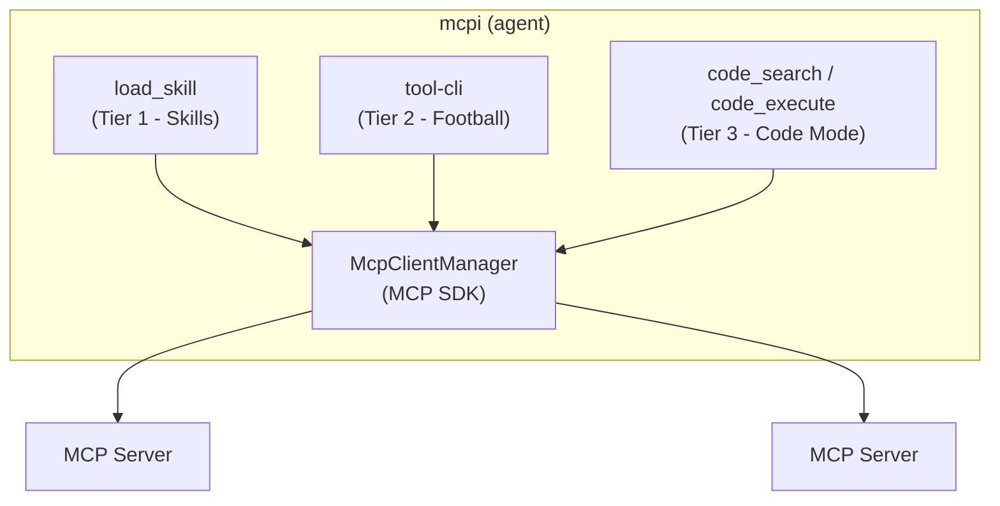

*This is the final Part of the Progressive Discovery in MCP series. See* [*Part 1*](/blog/progressive-discovery-in-mcp-part-1)*,* [*Part 2*](/blog/progressive-discovery-in-mcp-part-2)*,* [*Part 3*](/blog/progressive-discovery-in-mcp-part-3)*, and* [*Part 4*](/blog/progressive-discovery-in-mcp-part-4)*.*

I've spent four posts going deep on three tiers. This one is the synthesis. I want to make the case that having all three in one harness is cheaper than it looks, more useful than picking one, and worth doing now even though the spec is still in motion. Then I want to nudge the people who can actually move this forward: harness builders, MCP server authors, end users, and anyone with a stake in where the protocol goes next.

A confession to start with. The reason this series exists at all is that I gave [a talk at MCP Dev Summit](https://www.youtube.com/watch?v=ideYDMJKujE&list=PLjULwdJUtFdhIBhibLEogtK1XYCNaFyFl&index=10) titled "MCP vs CLI is the wrong question", spent a few months waiting for harness builders to take the obvious next step, and eventually got annoyed enough to build [mcpi](https://github.com/SamMorrowDrums/mcpi-ext) myself. I'd rather have written the post-mortem than the manifesto. But here we are.

## Three shapes of work, not three competing ideas

The reason for three tiers is that agents do three fundamentally different shapes of work with tools, and any single approach is bad at one or two of them.

**Procedural** - "do the canonical thing." There's a known workflow with known steps. PR review, issue triage, release prep. This is where [Skills](/blog/progressive-discovery-in-mcp-part-2) shine. The skill encodes the ceremony. The model doesn't have to reinvent the recipe and the harness gets to load only the tools the workflow actually needs.

**Investigative** - "I don't know what I'm looking for yet." Ad-hoc exploration, spot-checking, probing a server you've never used before. This is where [tool-cli](/blog/progressive-discovery-in-mcp-part-3) shines. Shell pipes, `jq` filters, `for` loops. Zero ceremony, maximum flexibility, and the intermediate data never roundtrips through the model.

**Reductive** - "turn N items into 1 summary." Pagination, aggregation, joins, math. The intermediate data is large, the answer is small. This is where [Code Mode](/blog/progressive-discovery-in-mcp-part-4) shines. The model writes code, the sandbox runs it, only the final value crosses back into context.

Most tasks lean on one of these. Some need two. The interesting ones need all three. Imagine preparing release notes for a busy repository: you follow the project's release-prep workflow (skill), aggregate 150 PRs into a categorised summary (Code Mode), then investigate the weird ones that don't fit your categories (tool-cli). One agent run, three modes of interaction, no friction at the seams.

The tiers aren't competing implementations of the same idea. They're handling different shapes.

## The headline thesis: it's cheap to ship all three

Here's the argument I want to land more than any other. **It's actually pretty cheap for a harness to offer all these approaches at once, and their different properties do actually make them more helpful for different tasks, so it's worth considering seriously if progressive discovery of MCP should be solved in more than one way in production agent harnesses.**

Roughly, what each tier costs a harness to add:

- **Skills** - one extra tool (`load_skill`), a `resources/list` call on connection to discover `skill://` resources, and a `defer_loading` hook (already first-class in [Anthropic's API](https://docs.claude.com/en/docs/agents-and-tools/tool-use/tool-search-tool) and [OpenAI's](https://platform.openai.com/docs/guides/tools-connectors-mcp), and trivially polyfillable elsewhere with a `tool_call` interceptor). The MCP server brings its own `skill://` payloads. There is no new spec dependency the client can't satisfy today.
- **tool-cli** - a JSON-RPC server bound to `127.0.0.1` with a per-session shared secret, and a tiny CLI binary. Four methods (`listServers`, `listTools`, `describeTool`, `callTool`). The protocol is in [the tool-cli repo](https://github.com/SamMorrowDrums/tool-cli) and the npm package is roughly the size of a long weekend.
- **Code Mode** - a sandbox you didn't write yourself ([isolated-vm](https://github.com/laverdet/isolated-vm), Workers isolates, [Anthropic's managed code execution](https://docs.claude.com/en/docs/agents-and-tools/tool-use/code-execution-tool), Pyodide, take your pick), an eligibility filter that whitelists `readOnlyHint: true` tools with `outputSchema`, and a callback bridge so `codemode.<tool>(...)` dispatches back through the same MCP client.

Each of those, in isolation, is a couple of weeks of work for a competent engineer. None of them require spec changes that aren't already in flight. And the leverage compounds: the audit log, the human-in-the-loop hooks, the rate limiting, and the annotation checks all live in the same place regardless of which tier the model uses.

The argument I keep hearing against doing all three is "we should just pick the best one." I'd push back hard on that. The "best one" is a function of the task, and an agent that has all three at hand is genuinely better at more tasks than one with any single strategy.

## One choke point still does the heavy lifting

The reason the tiers compose cleanly is that all three route MCP calls back through the same harness:

One audit trail. One place to add human-in-the-loop. One place to check tool annotations. One place to rate-limit. The model switches between tiers mid-task and the observability story doesn't change. Drop a `console.log` of every tool call in the harness's MCP client and you've covered all three tiers at once.

This is the part of the design that matters most for production. It's also the part most competing implementations have skipped, because they bolt one tier on top of MCP rather than rewiring the harness to own MCP. Server-side Code Mode without harness routing is closer to `eval()` than to a real agent runtime. A skill system that bypasses the harness can't gate destructive tools. A CLI that opens its own MCP connections doesn't get the agent's audit log. The choke point is what makes the other arguments work.

## Where the spec is, honestly

The spec is moving and it's worth being precise about what's settled and what isn't.

**Skills as primitive grouping.** The [Primitive Grouping Interest Group](https://github.com/modelcontextprotocol/access/pull/59) is real and active, with [Tapan Chugh](https://github.com/chughtapan) facilitating. The current draft I'm watching most closely is [`experimental-ext-grouping#13`](https://github.com/modelcontextprotocol/experimental-ext-grouping/pull/13), "Add Skills-as-Groups approach draft." It's open and being iterated on. I left review comments on it about keeping things stateless: I don't think referenced primitives should arrive via change-notifications. They should be available from the outset, and clients should choose to defer-load or expose them. That keeps the protocol simple and pushes the discovery cleverness into the client where it can vary by harness. There's also a parallel proposal, [SEP-2636: Progressive Tool Disclosure](https://github.com/modelcontextprotocol/modelcontextprotocol/pull/2636), which is worth tracking. The two aren't necessarily competing: skills-as-groups is a server-side metadata mechanism; progressive disclosure is a client-side strategy. The protocol benefits from both.

**Dynamic tool search.** [SEP-1821](https://github.com/modelcontextprotocol/modelcontextprotocol/issues/1821) and its proposed implementation [PR #1822](https://github.com/modelcontextprotocol/modelcontextprotocol/pull/1822) cover server-driven dynamic tool discovery. Anthropic's [tool search tool](https://www.anthropic.com/engineering/advanced-tool-use) is already shipping the model-side version of this idea; the spec work is about making it interoperable. Expect this to land in some form.

**Structured outputs.** Already in spec since [the 2025-06-18 release](https://modelcontextprotocol.io/specification/2025-11-25/server/tools#structured-content). Underused. This is the foundation Code Mode and the more interesting tool-cli `jq` workflows are built on. If you maintain a server with read-only tools and you haven't shipped `outputSchema` on them, you are leaving real progressive-discovery wins on the floor.

**MCP Apps / generative UI.** The [`ext-apps`](https://github.com/modelcontextprotocol/ext-apps) extension (SEP-1865, evolved from the [MCP-UI](https://mcpui.dev/) community work) gives the protocol a way to render typed structured outputs as interactive UI. Combined with Code Mode this is where the most exciting demos are going to come from over the next year. It's not in the core spec, but it's a real working extension.

**On the implementation side**, [PR #2382 on github-mcp-server](https://github.com/github/github-mcp-server/pull/2382) is still a draft. It adds `OutputSchema` and `StructuredContent` to read-only tools like `list_issues`, `search_code`, `list_pull_requests`, and `get_me`, plus twenty-seven skills replacing the old server instructions. I want it merged. It's the proof-of-life for skills-as-groups on a real high-traffic server, and it's the dependency that makes Code Mode actually useful against GitHub.

## What I haven't measured yet

I want to be honest about this: the design argument is the easy part. Numbers are coming. I'm working on evals comparing the three tiers (and combinations of them) against a baseline of "all tools loaded, no progressive discovery" on a fixed task set. If they land before too long, I'll add a follow-up post with the data. If they don't, I'll publish them as I have them. Don't take my word for any specific number until then.

What I'm confident about without evals is the directional argument: each tier reduces context for a different shape of work, the harness routing makes them safe to combine, and the cost of adding them is small enough that "ship all three" is the obvious answer for any harness that takes MCP seriously.

## What if we do none of this?

A fair question. What's the cost of the status quo, where harnesses don't ship skills, don't ship a tool-cli, don't ship Code Mode, and just keep loading every tool schema into every session?

The fallback that's actually cheap and shipping today is Anthropic's [Tool Search Tool](https://docs.claude.com/en/docs/agents-and-tools/tool-use/tool-search-tool). It's a single tool the model can call to search across deferred tools by keyword, with the matching tool definitions returned for use on the next turn. Properties:

- **The good.** Cheap to implement, no spec changes needed, plays nicely with prompt cache because the deferred tools never enter the system prompt until they're searched for. Real, measurable context savings on servers with many tools. If you do nothing else from this series, ship Tool Search.
- **The bad.** Discovery is purely model-driven. The model has to think "there might be a tool for this" and write a search query. It frequently doesn't, and instead either tries to do the task with whatever's already loaded, falls back on workarounds (writing bash, using direct APIs it half-remembers from training), or just hallucinates a function call. Skills push the right tools at the model when a workflow fires; Tool Search asks the model to pull. Pulling is harder.

So Tool Search Tool is a real option, and a good one. It's just not the ceiling.

The much worse outcome is that we don't even get that, and the pressure stays on server developers to keep their tool surface as small as possible. That's the path I want to argue against most strongly. A 1,000-tool MCP server with rich annotations and granular operations is a *better* server than a 20-tool consolidated one, *if* the client can do progressive discovery. Without progressive discovery, the 1,000-tool server is unusable and the consolidated one wins by default. That's a missed opportunity dressed up as a best practice. Server developers deserve a client ecosystem that lets them ship the surface area their domain actually needs.

## A nudge, in three directions

This is the part of the post I really wanted to write.

### If you build agent harnesses

[Mario was right](https://mariozechner.at/posts/2025-11-02-what-if-you-dont-need-mcp/) that two MCP servers exposing 47 tools through 32k tokens of schema is a bad agent experience. He was right that pipelining and keeping transforms out of context is the issue that really matters. Where I disagree is the conclusion. The implementations that prompted his post weren't MCP failing. They were MCP being shipped without context engineering. With the harness doing real work, the same protocol gives you a far better agent than four bash scripts and a 225-token README, while preserving observability, annotations, and a real security story.

Don't give up on MCP. The pieces are in the protocol, and the implementations are not difficult. If you ship one of the three tiers from this series this quarter, you will measurably improve your harness. If you ship all three, you will leapfrog every harness that picked one.

### If you build MCP servers

Three things worth doing, roughly in order of impact:

1. **Ship `outputSchema` on every read tool you can.** It costs you a JSON-Schema definition per tool. It unlocks Code Mode, makes tool-cli's pipe story work, and gives clients deterministic shapes to render UI from. There is almost no reason not to.
2. **Write `skill://` resources for the workflows your users actually run.** Not for every tool, just for the workflows that have a canonical recipe. Each skill replaces a chunk of server instructions and a chunk of tool descriptions, both of which were paid up-front in every session whether they were needed or not.
3. **Stop treating server instructions as the place workflow guidance lives.** They're a monolith, they load at connection, and they don't know what the user is doing. Skills cost a tiny amount of context to advertise and unlock the full workflow body only when needed. The economics aren't close.

### If you use agents

You can demand more of your MCP implementations. If your harness is loading hundreds of tool schemas you'll never use into every session, that's a choice the harness made for you. Ask for progressive discovery. Ask for skills. Ask for code mode for read-only aggregations. The signal that users want this is part of what moves harness vendors.

### If you want to influence the protocol

I'm a maintainer of MCP and an active member of a few of its working and interest groups, so I can speak to this directly. The way contributions, comments, and feedback get received is not gatekept. The most useful thing you can bring to a spec discussion is not strong opinions: it's data, an implementation intention ("here's what I'd build if this were spec'd this way"), and concrete use-cases. Open issues. Comment on SEPs. Comment on draft PRs like [`experimental-ext-grouping#13`](https://github.com/modelcontextprotocol/experimental-ext-grouping/pull/13). Show up to the working-group meetings. Ship a prototype and link to it. The people steering the protocol are explicitly looking for this kind of input, not just from large vendors. If you've been waiting for an invitation, this is it.

## Mistakes I made as an MCP server developer

Some honesty before the closer. I've worked on the [GitHub MCP Server](https://github.com/github/github-mcp-server) for over a year. I got real things wrong, and most of them are relevant to anyone in a similar position.

**I expected clients to fix the implementation problems.** I assumed harness builders were as motivated as I was to do real context engineering on top of MCP, and would course-correct as the tool count problem became obvious. They weren't, and they didn't. They mostly preferred to work around the protocol (consolidating tools, writing CLIs, leaning on bash) rather than push back into the harness. That's a perfectly reasonable engineering decision in the short term, and it left every MCP server in the same spot regardless of how thoughtfully it was built. The lesson: if you build a server, don't wait. Ship the experiments yourself, even as an extension or a fork. The signal from working code is louder than the signal from issue comments.

**I thought I didn't need to share the challenges, experiences, and solutions from the server side.** They weren't as obvious to anyone outside the project as I assumed. Things that felt routine to us (why we have so many tools, why we consolidated some and not others, why we picked the annotations we did, why server instructions sit where they do) turned out to be useful context for harness builders trying to design around us. This series is partly an attempt to fix that, retroactively. If you maintain a server with non-trivial usage, write down what you've learned. The ecosystem benefits more than you'd expect.

**The MCP spec itself made some calls that haven't aged as well as we'd hoped.** Server instructions are the obvious one; skills feel like such a clear replacement to me at this point that I'd rather have skills as the only mechanism. [Dynamic Client Registration](https://modelcontextprotocol.io/specification/2025-11-25/basic/authorization#dynamic-client-registration) has rough edges in practice. There are still bits being ironed out. None of that is fatal. The protocol has the capacity to evolve (it's already deprecated [Roots, Sampling, and Logging](https://github.com/modelcontextprotocol/modelcontextprotocol/pull/2577) when they didn't earn their keep), and that capacity is itself one of MCP's most underrated properties.

The thing I keep running into is people who think the differences between MCP, CLIs, APIs, and skills are trivialities. They are objectively wrong, and I say that with some confidence. I've watched fairly staunch MCP critics realise they absolutely have to have first-class support for [MCP Apps](https://github.com/modelcontextprotocol/ext-apps) because generative UI is a huge unlock for productivity work, and there is no clean way to land that on top of a CLI or a raw API. Don't underestimate the power of a specification built for agents that distinguishes between agents and end users, between operators and consumers, between tools and resources, between prompts and skills. And critically, don't mistake a protocol for the implementations you've seen of it. The early implementations are how MCP got dismissed; the next generation of implementations is how it gets taken seriously.

## The future of MCP is genuinely exciting

The takes that say MCP is a flash in the pan, that skills will replace it, that CLIs make it redundant, miss what the protocol is actually for. MCP is not "a tool list format." It's a contract between three parties (server, client, model) with the capacity to evolve as agent needs evolve, and it's one of the few places in the agent stack where that contract is explicit, versioned, and negotiable.

That capacity is the thing. We've already seen it absorb structured outputs, resources, prompts, sampling, and now primitive grouping. We're about to see it absorb generative UI through MCP Apps. The discovery problem (how do we expose the right tools to the right model at the right time?) is hard, and it isn't going to have one universal answer. The protocol that's flexible enough to host skills, CLIs, and Code Mode against the same servers, and to distinguish between agent users, end users, and operators, is the protocol that gets to keep evolving. The protocols that pick one answer get to be obsolete.

What I want to happen now is for everyone to keep iterating. Keep experimenting. Build weird and wonderful clients. Push the spec. Build agents that can truly discover the tools they actually need from many thousands without choking on context, without hallucinating substitutes, without falling back on workarounds. We should not settle for less than that, and we don't have to.

The agents that work best over the next few years will be the ones whose harnesses are smart about what they reveal and when. MCP is the layer where that smartness is portable. That's worth showing up for.

## Try it yourself, and what to read next

The [mcpi-ext source](https://github.com/SamMorrowDrums/mcpi-ext) is public, the [tool-cli package](https://github.com/SamMorrowDrums/tool-cli) is on npm, and the [GitHub MCP Server skill-discovery branch](https://github.com/github/github-mcp-server/pull/2382) ships a working set of skills you can experiment with today. If you went through any of the earlier parts' setup sections you already have everything installed.

A short reading list, in roughly the order I'd suggest:

- [Anthropic on advanced tool use](https://www.anthropic.com/engineering/advanced-tool-use) and [code execution with MCP](https://www.anthropic.com/engineering/code-execution-with-mcp) - the model-side and execution-side state of the art.
- [Cloudflare's Code Mode](https://blog.cloudflare.com/code-mode/) and [Matt Carey's Code Mode + MCP](https://blog.cloudflare.com/code-mode-mcp/) follow-up - the production case for code over tools.
- [`experimental-ext-grouping#13`](https://github.com/modelcontextprotocol/experimental-ext-grouping/pull/13) and [SEP-2636](https://github.com/modelcontextprotocol/modelcontextprotocol/pull/2636) - where the spec conversation is happening right now.
- [Ruben Casas on generative UI for MCP Apps](https://www.youtube.com/watch?v=hCMrEfPG2Yg) - the next thing structured outputs unlock.
- [My MCP Dev Summit talk](https://www.youtube.com/watch?v=ideYDMJKujE&list=PLjULwdJUtFdhIBhibLEogtK1XYCNaFyFl&index=10) - the original "MCP vs CLI is the wrong question" argument that started this whole thing.

If you build something on top of any of this, disagree with any of it, or just want to compare notes, the [discussion thread for this series](https://github.com/SamMorrowDrums/cv/discussions/63) is open. I'd genuinely love to hear what you're building.

---

*Have thoughts on this article or progressive discovery in MCP in general? I opened a* [*discussion on GitHub*](https://github.com/SamMorrowDrums/cv/discussions/63) *for this series.*
